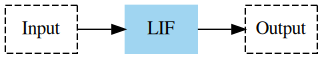
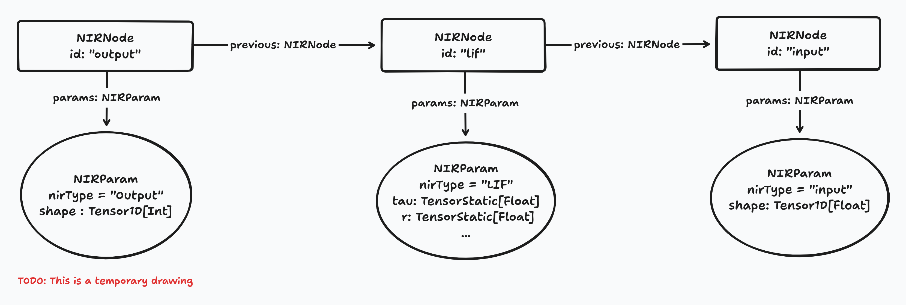

# Using a NIRGraph

1. The NIRGraph imported in [Importing a NIRGraph](import.md) has the following structure
   

2. In the ADT, this looks like
 
 - **Notice**:
   1. They link 'backwards', top is Output node, bottom is Input node.
   2. The tensor types, documented in [Tensors](tensors.md), depend on whether we know the dimensions in advance or not.

3.
